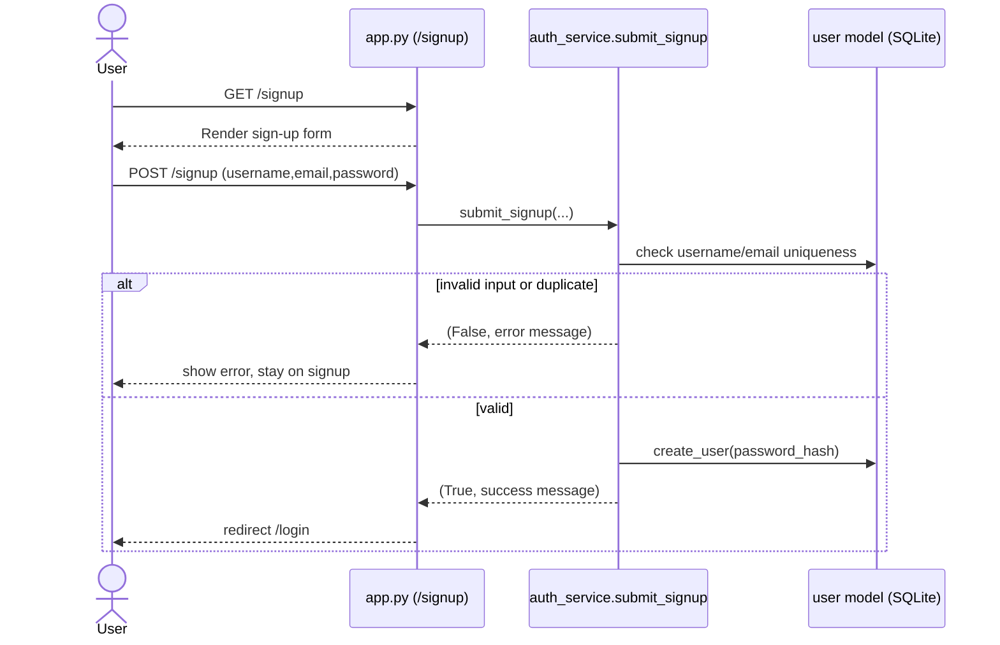
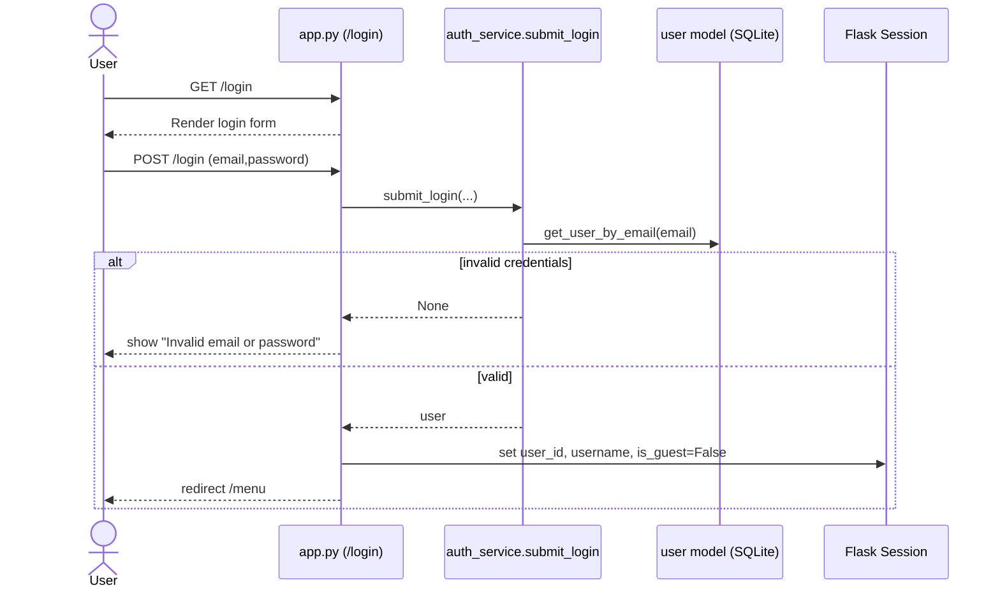
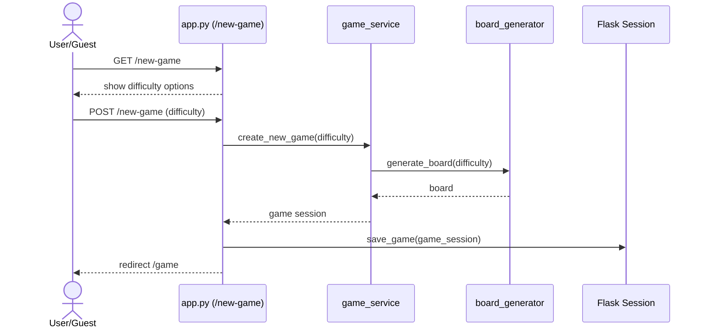
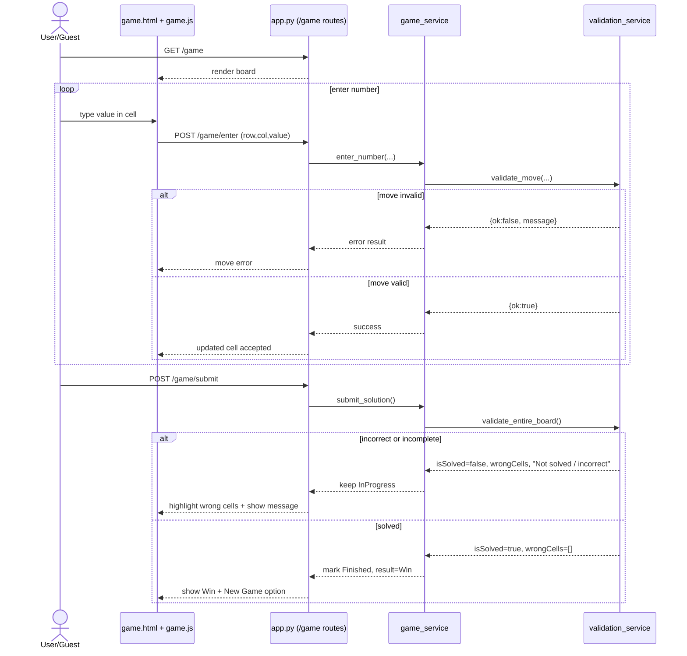

# Kakuro Iteration 1 - Code Flow Map and Diagrams

This document maps the current implementation to the 4 required flows using the code that exists now.

## File Flow Map

### Flow 1: Sign Up (Create Account)
- `kakuro/app.py` - `GET /signup`, `POST /signup`
- `kakuro/services/auth_service.py` - `submit_signup(...)`
- `kakuro/models/user.py` - `get_user_by_username(...)`, `get_user_by_email(...)`, `create_user(...)`
- `kakuro/templates/signup.html`

### Flow 2: Log In
- `kakuro/app.py` - `GET /login`, `POST /login`
- `kakuro/services/auth_service.py` - `submit_login(...)`
- `kakuro/models/user.py` - `get_user_by_email(...)`
- `kakuro/templates/login.html`

### Flow 3: Start New Game
- `kakuro/app.py` - `GET /new-game`, `POST /new-game`
- `kakuro/services/game_service.py` - `create_new_game(...)`, `save_game(...)`
- `kakuro/services/board_generator.py` - `generate_board(...)`
- `kakuro/templates/difficulty.html`, `kakuro/templates/game.html`

### Flow 4: Play Game
- `kakuro/app.py` - `GET /game`, `POST /game/enter`, `POST /game/submit`
- `kakuro/services/game_service.py` - `enter_number(...)`, `submit_solution(...)`, `get_feedback(...)`
- `kakuro/services/validation_service.py` - `validate_move(...)`, `validate_entire_board(...)`
- `kakuro/static/js/game.js` - sends move requests, displays feedback
- `kakuro/templates/game.html` - board UI, wrong-cell highlight, submit/new-game actions

---

## Flow 1 - Sign Up (Create Account)

### Step Mapping
- `openSignUpPage()` -> `GET /signup` in `kakuro/app.py`.
- `displaySignUpForm()` -> `kakuro/templates/signup.html`.
- `submitSignUp(username,email,password)` -> `POST /signup` in `kakuro/app.py`, then `submit_signup(...)` in `kakuro/services/auth_service.py`.
- ALT branch (invalid input or duplicate username/email) -> route flashes error and re-renders sign-up page.
- Success branch -> flashes success and redirects to `GET /login`.

### Preconditions and Postconditions from Code
- Preconditions checked:
  - required fields exist,
  - email format is basic-valid,
  - username is unique,
  - email is unique.
- Postconditions achieved:
  - password is hashed,
  - user is inserted in SQLite `users` table.

### Sequence Diagram


---

## Flow 2 - Log In

### Step Mapping
- `openLoginPage()` -> `GET /login` in `kakuro/app.py`.
- `displayLoginForm()` -> `kakuro/templates/login.html`.
- `submitLogin(email,password)` -> `POST /login`, then `submit_login(...)` in `kakuro/services/auth_service.py`.
- ALT branch -> if credentials invalid, error message and stay on login.
- Success branch -> session keys are set (`user_id`, `username`, `is_guest=False`) and redirect to `/menu`.

### Preconditions and Postconditions from Code
- Preconditions checked:
  - email and password provided,
  - user exists for email,
  - password hash check passes.
- Postconditions achieved:
  - authenticated user is retrieved,
  - session is created for logged-in state.

### Sequence Diagram


---

## Flow 3 - Start New Game

### Step Mapping
- `startNewGame()` + `displayDifficultyOptions()` -> `GET /new-game` in `kakuro/app.py`.
- `selectDifficulty(difficulty)` equivalent -> `POST /new-game` in `kakuro/app.py` (current route name).
- Board creation -> `create_new_game(...)` -> `generate_board(difficulty)`.
- Game launch -> redirect to `GET /game` and render `kakuro/templates/game.html`.

### Preconditions and Postconditions from Code
- Preconditions checked:
  - player context exists (guest or logged-in),
  - difficulty is in `{easy, medium, hard}`.
- Postconditions achieved:
  - new `GameSession` is created,
  - new board is generated from selected difficulty,
  - active game is stored in Flask session.

### Sequence Diagram


---

## Flow 4 - Play Game

### Step Mapping
- `displayGameBoard(board)` -> `GET /game` renders `kakuro/templates/game.html`.
- `enterNumber(row,col,value)` equivalent -> `POST /game/enter` (AJAX from `kakuro/static/js/game.js`).
- Move validation -> `enter_number(...)` -> `validate_move(...)`.
- `submitSolution()` -> `POST /game/submit` -> `submit_solution(...)` -> `validate_entire_board(...)`.
- ALT submit branch -> message "Not solved / incorrect" + wrong cell list.
- Success submit branch -> message "Win" + game status finished.
- New game option -> button/link back to `/new-game` in `kakuro/templates/game.html`.

### Preconditions and Postconditions from Code
- Preconditions checked for move:
  - active game session exists,
  - target coordinates are valid,
  - target is playable cell,
  - value is empty or 1-9.
- Postconditions for move:
  - cell value updates when valid,
  - board state is saved.
- Postconditions for submit:
  - solved board -> status `Finished`, win result,
  - unsolved/incorrect board -> status `InProgress`, wrong cells returned for highlight.

### Sequence Diagram


---

## Scope Notes from Current Code
- Guest gameplay is implemented (`POST /guest`, session `is_guest=True`).
- Basic validation is implemented (1-9 values, duplicate-in-run check, board submit check).
- Wrong-cell highlighting on submit is implemented (`wrongCells` from validation to template/UI).
- Current route names are close to diagram intent, but not exact in two places:
  - `POST /new-game` is used for difficulty selection.
  - `POST /game/enter` is used for entering a number.

---

## Testing Summary (What We Test and How to Run)

### What is covered
- `tests/test_auth.py`
  - Sign-up uniqueness checks for username and email.
  - Login credential validation (correct and incorrect password).
  - Route behavior after sign-up (`POST /signup` redirects to `/login`).
- `tests/test_validation.py`
  - Move-level validation rejects duplicate values in the same run.
  - Move-level validation allows non-final sums until submit.
  - Submit-level validation flags wrong cells and detects win state.
- `tests/test_game_flow.py`
  - `POST /game/submit` keeps game `InProgress` for incorrect board.
  - `POST /game/submit` marks game `Finished` and win for correct board.

### How to run
```bash
python -m pytest
```

Run single files if needed:
```bash
python -m pytest tests/test_auth.py
python -m pytest tests/test_validation.py
python -m pytest tests/test_game_flow.py
```
