# Kakuro Iteration 2 - Code Flow Map and Diagrams

This document maps the current implementation to the Iteration 2 UML flows using the code that exists now.

## File Flow Map

### Flow 1: Sign Up (Create Account)

- `kakuro/app.py` - `GET /signup`, `POST /signup`
- `kakuro/services/auth_service.py` - `submit_signup(...)`
- `kakuro/models/user.py` - `get_user_by_username(...)`, `get_user_by_email(...)`, `create_user(...)`
- `kakuro/models/domain.py` - `User` dataclass
- `kakuro/db/schema.sql` - `users` table
- `kakuro/templates/signup.html`

### Flow 2: Log In

- `kakuro/app.py` - `GET /login`, `POST /login`, `POST /logout`
- `kakuro/services/auth_service.py` - `submit_login(...)`
- `kakuro/models/user.py` - `get_user_by_email(...)`
- `kakuro/models/domain.py` - `User`, `RegisteredUser`, `GuestUser` concepts
- `kakuro/templates/login.html`
- `kakuro/templates/base.html` - logged-in vs guest nav/logout UI

### Flow 3: Start New Game

- `kakuro/app.py` - `GET /new-game`, `POST /new-game`, `GET /game`
- `kakuro/services/game_service.py` - `create_new_game(...)`, `save_game(...)`, `get_game(...)`
- `kakuro/services/board_generator.py` - `generate_board(...)`
- `kakuro/models/domain.py` - `GameSession`, `Board`, `PlayCell`, `ClueCell`, `DifficultyLevel`
- `kakuro/templates/difficulty.html`, `kakuro/templates/game.html`

### Flow 4: Play Game

- `kakuro/app.py` - `GET /game`, `POST /game/enter`, `POST /game/submit`, `POST /game/pause`, `POST /game/resume`, `POST /game/save`, `GET /game/load`
- `kakuro/services/game_service.py` - `enter_number(...)`, `submit_solution(...)`, `set_paused(...)`, `save_current_game(...)`, `load_latest_saved_game(...)`, `get_feedback(...)`
- `kakuro/services/validation_service.py` - `validate_move(...)`, `validate_entire_board(...)`
- `kakuro/models/saved_game.py` - persistence for save/load
- `kakuro/models/domain.py` - gameplay entities and session state
- `kakuro/templates/game.html` - board UI, wrong-cell rendering, pause overlay, save form
- `kakuro/static/js/game.js` - move AJAX, timer, pause/resume, submit sync
- `kakuro/static/css/styles.css` - pause blur and wrong-cell highlighting styles
- `kakuro/db/schema.sql` - `saved_games` table

### Flow 4A: enterNumber

- `kakuro/app.py` - `POST /game/enter`
- `kakuro/services/game_service.py` - `enter_number(...)`
- `kakuro/services/validation_service.py` - `validate_move(...)`
- `kakuro/models/domain.py` - `Board.validateEntry(...)` equivalent domain rule
- `kakuro/static/js/game.js` - sends `/game/enter` requests
- `kakuro/templates/game.html` - input cells

### Flow 4B: checkHint

- `kakuro/models/domain.py` - `GameSession.checkHint(...)`, `PlayCell.hinted`
- No route, service call, template action, or JS action currently wired for hint checking.

### Flow 4C: removeNumber

- `kakuro/app.py` - `POST /game/enter` (empty `value` acts as removal)
- `kakuro/services/game_service.py` - `enter_number(...)`
- `kakuro/services/validation_service.py` - `_parse_value(...)` maps empty to `None`
- `kakuro/models/domain.py` - `GameSession.removeNumber(...)` exists but is not called by routes
- `kakuro/static/js/game.js` - clearing a cell triggers sync to `/game/enter`
- `kakuro/templates/game.html` - editable input cells

### Flow 4D: submitBoard

- `kakuro/app.py` - `POST /game/submit`
- `kakuro/services/game_service.py` - `submit_solution(...)`
- `kakuro/services/validation_service.py` - `validate_entire_board(...)`
- `kakuro/models/domain.py` - `GameSession.submitBoard(...)`, `Result`
- `kakuro/templates/game.html` - submit button, wrong-cells coordinates, result message
- `kakuro/static/css/styles.css` - wrong-cell visual state

### Flow 4E: pauseGame

- `kakuro/app.py` - `POST /game/pause`, `POST /game/resume`
- `kakuro/services/game_service.py` - `set_paused(...)`, `is_paused(...)`
- `kakuro/models/domain.py` - `GameSession.pauseGame(...)`, `resumeGame(...)`
- `kakuro/templates/game.html` - pause button, overlay, locked controls
- `kakuro/static/js/game.js` - pause/resume requests, timer stop/start, lock board
- `kakuro/static/css/styles.css` - `.pause-target.is-paused` blur + overlay styles

### Flow 4F: saveGame

- `kakuro/app.py` - `POST /game/save`
- `kakuro/services/game_service.py` - `save_current_game(...)`
- `kakuro/models/saved_game.py` - `upsert_saved_game(...)`
- `kakuro/models/domain.py` - `GameSession`, `SavedGame`
- `kakuro/db/schema.sql` - `saved_games`
- `kakuro/templates/game.html` - save form in pause overlay
- `kakuro/static/js/game.js` - sends elapsed time in hidden field before submit

### Flow 4G: loadGame

- `kakuro/app.py` - `GET /game/load`
- `kakuro/services/game_service.py` - `load_latest_saved_game(...)`
- `kakuro/models/saved_game.py` - `get_latest_saved_game_for_user(...)`
- `kakuro/models/domain.py` - `SavedGame.restore(...)`, `GameSession.from_dict(...)`, `Board.from_dict(...)`
- `kakuro/templates/main_menu.html`, `kakuro/templates/base.html` - load links
- `kakuro/templates/game.html`, `kakuro/static/js/game.js` - restored elapsed time rendering

### Flow 5: Leaderboard

- `kakuro/app.py` - `GET /menu`
- `kakuro/services/leaderboard_service.py` - `get_leaderboard(...)`, `calculate_score(...)`, `record_completed_game(...)`
- `kakuro/models/leaderboard.py` - `get_top_leaderboard_entries(...)`, `add_leaderboard_entry(...)`
- `kakuro/db/schema.sql` - `leaderboard_entries` table
- `kakuro/templates/main_menu.html` - leaderboard table UI

---

## Flow 1 - Sign Up (Create Account)

### Step Mapping

- `openSignUpPage()` -> `GET /signup` in `kakuro/app.py` -> renders `kakuro/templates/signup.html`.
- `displaySignUpForm()` -> HTML form in `kakuro/templates/signup.html`.
- `submitSignUp(username,email,password)` -> `POST /signup` in `kakuro/app.py` -> `submit_signup(...)` in `kakuro/services/auth_service.py`.
- `validate input` -> checks required fields, basic email format, and min password length (6) in `submit_signup(...)`.
- `validate username uniqueness` -> `get_user_by_username(...)` in `kakuro/models/user.py`.
- `validate email uniqueness` -> `get_user_by_email(...)` in `kakuro/models/user.py`.
- `create user` -> password hashed via `generate_password_hash(...)`, then `create_user(...)` writes into SQLite.
- `redirect to login on success` -> route flashes success and redirects to `GET /login`.
- ALT branch -> route flashes error and re-renders `signup.html` with entered username/email.

### Preconditions and Postconditions from Code

- Preconditions checked:
- username/email/password must all be present.
- email must include `@` and dot in domain suffix.
- password length must be at least 6.
- username must not already exist.
- email must not already exist.
- Postconditions achieved:
- `users` row inserted with `username`, `email`, `password_hash`, `created_at`.
- plain password is not stored; hash is stored.
- UI transitions to login page on success.

### Class Diagram Mapping

- `User` concept is implemented as `User` dataclass in `kakuro/models/domain.py` and persisted in `users` table via `kakuro/models/user.py`.
- No ORM entity class is used; persistence is function-based repository style with raw `sqlite3`.

### Sequence System

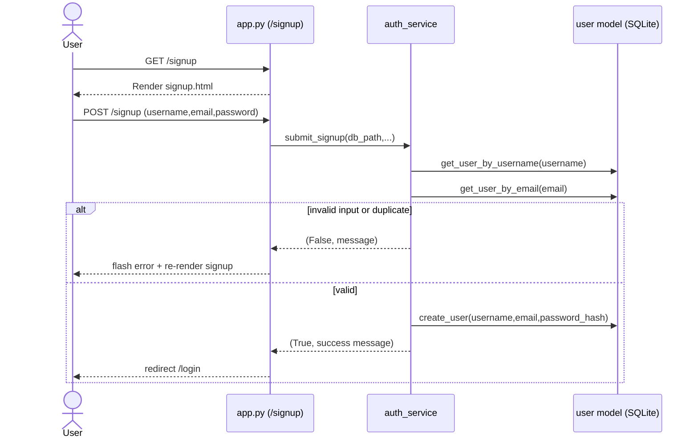

---

## Flow 2 - Log In

### Step Mapping

- `openLoginPage()` -> `GET /login` in `kakuro/app.py` -> renders `kakuro/templates/login.html`.
- `displayLoginForm()` -> HTML form in `kakuro/templates/login.html`.
- `submitLogin(email,password)` -> `POST /login` in `kakuro/app.py` -> `submit_login(...)` in `kakuro/services/auth_service.py`.
- `retrieve user by email` -> `get_user_by_email(...)` in `kakuro/models/user.py`.
- `compare password` -> `check_password_hash(...)` in `submit_login(...)`.
- `mark user logged in` -> route sets `session["user_id"]`, `session["username"]`, `session["is_guest"]=False`, clears old state.
- `redirect to main menu` -> route redirects to `GET /menu`.
- `logout` in Iteration 2 scope -> `POST /logout` clears session and redirects to `/`.

### Preconditions and Postconditions from Code

- Preconditions checked:
- email and password must be non-empty.
- user must exist for provided email.
- password hash must match.
- Postconditions achieved:
- authenticated session state is created for registered user.
- guest/auth residual state is cleared before setting logged-in session.
- game feedback and paused flags are reset on login.

### Class Diagram Mapping

- `RegisteredUser` is represented in runtime by session state (`user_id` present, `is_guest=False`), not by instantiating `RegisteredUser`.
- `GuestUser` is represented by session state (`is_guest=True`, no `user_id`), not by creating a guest DB user.

### Sequence System

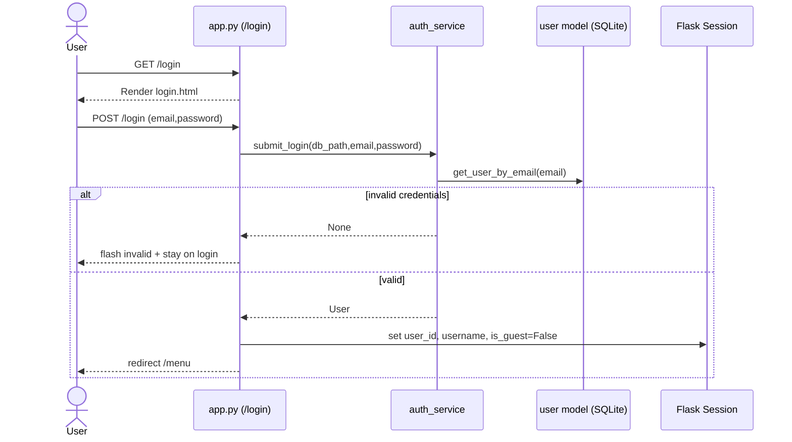

---

## Flow 3 - Start New Game

### Step Mapping

- `startNewGame()` entry -> `GET /new-game` in `kakuro/app.py`.
- `displayDifficultyOptions()` -> `kakuro/templates/difficulty.html`.
- `selectDifficulty(difficulty)` -> `POST /new-game` (route name differs from UML `select-difficulty` naming).
- `create game session` -> `create_new_game(...)` in `kakuro/services/game_service.py`.
- `generate board` -> `generate_board(difficulty)` in `kakuro/services/board_generator.py`.
- `associate board with game session` -> `GameSession(board=...)` + `save_game(game_session)` in server session.
- `display game board` -> redirect `GET /game` and render `kakuro/templates/game.html`.

### Preconditions and Postconditions from Code

- Preconditions checked:
- player context required (guest or logged-in user).
- difficulty must be one of `easy`, `medium`, `hard`.
- Postconditions achieved:
- new `GameSession` created with fresh UUID-like `sessionId`.
- generated `Board` includes `PlayCell`/`ClueCell` structure from selected difficulty.
- active game persisted under Flask session key `active_game`.
- feedback and pause flags reset.

### Class Diagram Mapping

- `GameSession` maps directly to `kakuro/models/domain.py::GameSession`.
- `Board`/`Cell`/`PlayCell`/`ClueCell` map directly to dataclasses in `kakuro/models/domain.py`.
- `DifficultyLevel` enum normalizes `GameSession.difficulty` values.

### Sequence System

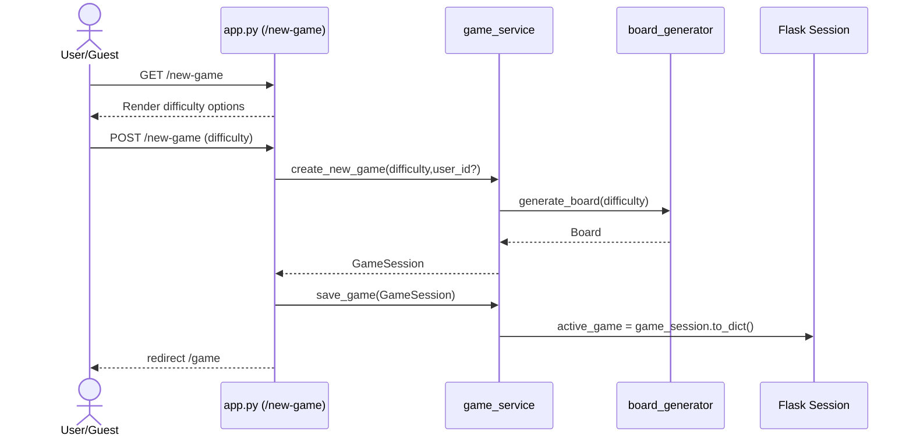

---

## Flow 4 - Play Game

### Step Mapping

- `display game board` -> `GET /game` in `kakuro/app.py` renders `kakuro/templates/game.html`.
- `enter number` -> `kakuro/static/js/game.js` sends `POST /game/enter` to backend.
- `validate move` -> `game_service.enter_number(...)` -> `validation_service.validate_move(...)`.
- `submit/check solution` -> submit form posts to `POST /game/submit`.
- `validate full board` -> `validate_entire_board(...)` and wrong cell list returned.
- `highlight incorrect cells` -> wrong keys passed by route and rendered as `.wrong-cell` in template/CSS.
- `display result` -> flash + in-page `game_message`; win sets `GameSession.status="Finished"` and `Result`.
- `pause/resume` -> JS button + `POST /game/pause` and `POST /game/resume`.
- `timer` -> JS interval in `kakuro/static/js/game.js`; stopped on pause.
- `blur background on pause` -> CSS class toggle `is-paused` and `.pause-overlay` visibility.
- `save game` -> pause overlay form posts `POST /game/save` (registered users only).
- `load game` -> `GET /game/load` from menu/nav for logged-in users.

### Preconditions and Postconditions from Code

- Preconditions checked:
- player context required for `/game`.
- active game required for enter/pause/resume/save/submit.
- paused state blocks enter/submit.
- finished state blocks enter.
- save requires logged-in `user_id`.
- Postconditions achieved:
- move updates persist in active session on successful validation.
- submit updates game status/result and wrong-cell feedback.
- pause updates both session flag and `GameSession.isPaused`.
- save/load persist and restore board state and elapsed time from SQLite `saved_games`.

### Class Diagram Mapping

- Main flow uses `GameSession` aggregate with embedded `Board` and optional `Result`.
- Persistence of save/load uses `SavedGame` data concept (dataclass + `saved_games` rows).
- Guest/registered behavior is role logic in session flags, not polymorphic runtime objects.

### Sequence System

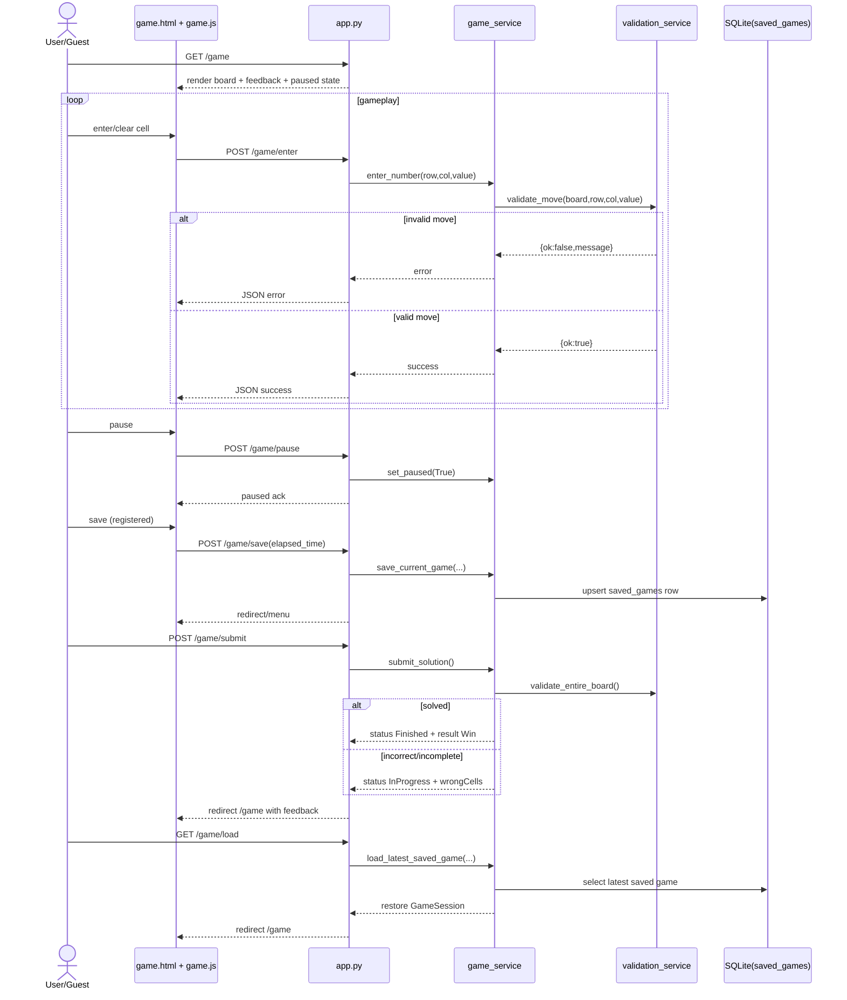

---

## Flow 4A - enterNumber

### Step Mapping

- UML `enterNumber(row,col,value)` -> `POST /game/enter` in `kakuro/app.py`.
- Route parses `row`/`col` to integers and reads string `value`.
- Calls `enter_number(...)` in `kakuro/services/game_service.py`.
- Service checks active game exists, game not finished, game not paused.
- Service calls `validate_move(...)` in `kakuro/services/validation_service.py`.
- `validate_move(...)` checks coordinate bounds, playable cell, value format (`""` or `1-9`), and duplicate-in-run rules.
- On success, `save_game(...)` persists updated board in session and feedback is cleared.
- Route stores move error text (`set_move_error(...)`) on failure and returns JSON for AJAX.

### Preconditions and Postconditions from Code

- Preconditions checked:
- active game session must exist.
- game must not be `Finished`.
- game must not be paused.
- row/col must parse to valid integers and point to a playable cell.
- value must be empty or digit 1-9.
- duplicate digit in across/down run is rejected.
- Postconditions achieved:
- valid move updates cell value in board state and session.
- invalid move restores old value and returns explicit message.

### Class Diagram Mapping

- Operation is performed on `GameSession.board` (`Board` + `Cell` objects).
- `PlayCell` objects hold mutable value state; clue cells are non-playable.

### Sequence System

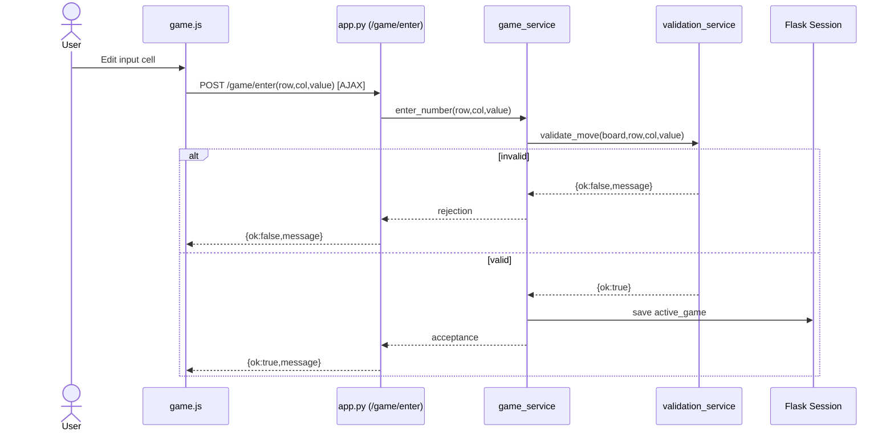

---

## Flow 4B - checkHint

### Step Mapping

- UML expects hint request operation.
- Current backend has `GameSession.checkHint()` in `kakuro/models/domain.py`.
- That method finds first empty playable cell and marks `PlayCell.hinted=True`.
- There is currently no `POST /game/check-hint` (or equivalent) route in `kakuro/app.py`.
- There is no `game_service` hint method, no hint button in `game.html`, and no hint call in `game.js`.

### Preconditions and Postconditions from Code

- Diagram expects an active-session hint operation, but current code does not expose it through HTTP/UI.
- Postcondition currently available only at domain-method level (if called manually): one empty cell gets `hinted=True` and coordinate tuple is returned.
- No hint count tracking exists.

### Class Diagram Mapping

- `checkHint` concept is partially represented in `GameSession` + `PlayCell.hinted`.
- Use-case realization is incomplete because application/service layers do not call it.

### Sequence System

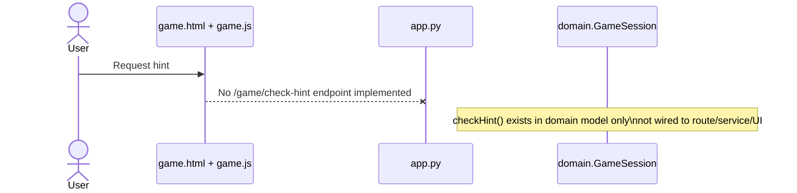

---

## Flow 4C - removeNumber

### Step Mapping

- UML `removeNumber(row,col)` is not a dedicated route in current code.
- Actual implementation uses `POST /game/enter` with `value=""` (empty string) to clear cell.
- In `validate_move(...)`, empty input is parsed as `None`, then assigned to cell value.
- `game.js` sends current input value on change; deleting cell content triggers sync with empty value.
- Domain method `GameSession.removeNumber(...)` exists but is not called by controller/service.

### Preconditions and Postconditions from Code

- Preconditions checked:
- same as enter-number preconditions (active session, not paused/finished, valid playable coordinates).
- Postconditions achieved:
- target playable cell value becomes `None` (empty).
- board session state is saved when move is accepted.

### Class Diagram Mapping

- `removeNumber` behavior is implemented operationally via `enterNumber` endpoint contract, not a separate application operation.
- Domain-level `removeNumber(...)` exists as a conceptual match but is currently unused.

### Sequence System

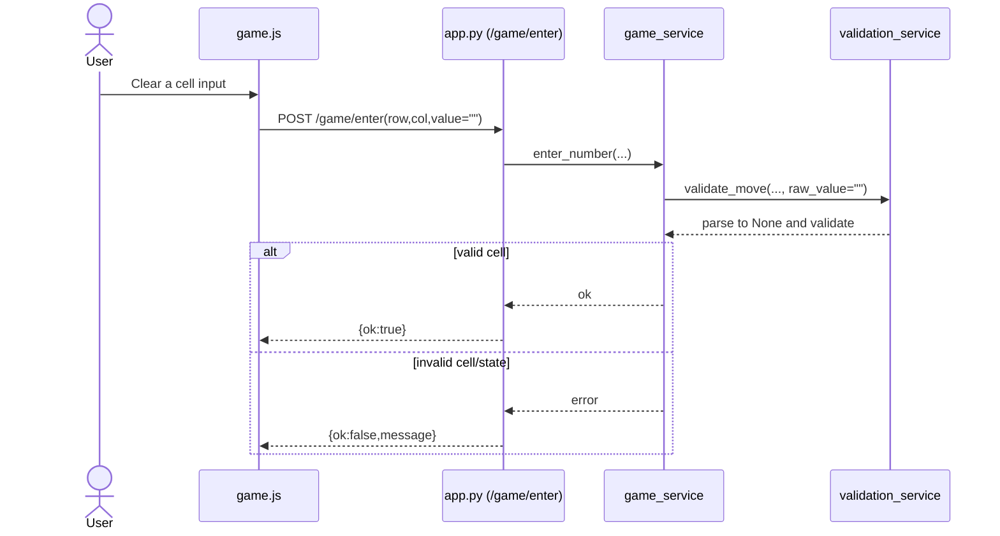

---

## Flow 4D - submitBoard

### Step Mapping

- `submitBoard()` -> `POST /game/submit` in `kakuro/app.py`.
- Route calls `submit_solution()` in `kakuro/services/game_service.py`.
- Service checks active game exists and game is not paused.
- Service runs `validate_entire_board(...)` in `kakuro/services/validation_service.py`.
- Service calls `game_session.submitBoard()` (sets `isSubmitted=True`).
- Incorrect/incomplete branch:
- game stays `InProgress`, `result=None`, wrong cells saved in feedback.
- Correct branch:
- game becomes `Finished`, `isCompleted=True`, `isPaused=False`, `Result(isWin=True)` created.
- Route flashes win or incorrect message and redirects back to `/game`.
- `GET /game` renders wrong cells + message; template applies `wrong-cell` class.

### Preconditions and Postconditions from Code

- Preconditions checked:
- active game session required.
- submit blocked while paused.
- Postconditions achieved:
- submit attempt marks `isSubmitted=True`.
- solved board sets finished/win result.
- unsolved board keeps in-progress state and returns wrong-cell coordinates.
- feedback (`wrong_cells`, `game_message`) stored in session for rendering.

### Class Diagram Mapping

- `submitBoard` maps to `GameSession.submitBoard()` plus validation service.
- `Result` object maps UML result/win artifact when solved.
- Wrong-cell highlighting is UI projection of validation output, not separate class.

### Sequence System

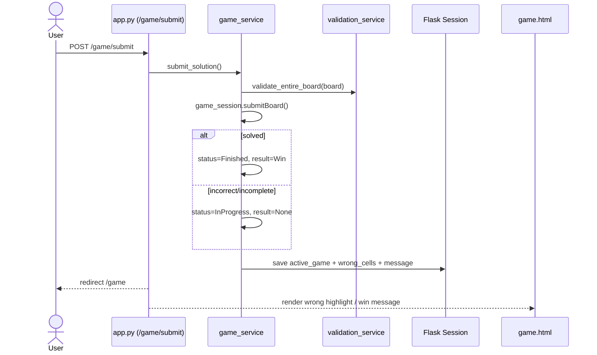

---

## Flow 4E - pauseGame

### Step Mapping

- `pauseGame()` -> pause button in `kakuro/templates/game.html` (`#pauseGameBtn`).
- JS handler in `kakuro/static/js/game.js` first syncs pending inputs, then calls `POST /game/pause`.
- Route `pause_game_route` in `kakuro/app.py` calls `set_paused(True)`.
- `set_paused(...)` in `kakuro/services/game_service.py` calls `game_session.pauseGame()` and persists state.
- JS `applyPausedState(true)`:
- adds `.is-paused` to `#pauseTarget` (blur effect),
- shows pause overlay,
- disables board inputs and submit button,
- stops timer interval.
- Resume path mirrors this via `POST /game/resume` and `applyPausedState(false)`.
- Backend also blocks move/submit while paused.

### Preconditions and Postconditions from Code

- Preconditions checked:
- active game session must exist for pause/resume endpoint success.
- pause only sets `isPaused` if game is not completed (`GameSession.pauseGame`).
- Postconditions achieved:
- server-side pause state stored in `GameSession.isPaused` and `session["game_paused"]`.
- UI blur/overlay is front-end rendering behavior.
- timer is JS-side and is stopped/started locally, not continuously server-tracked.

### Class Diagram Mapping

- `pauseGame` operation maps directly to `GameSession.pauseGame()` and `resumeGame()`.
- No separate timer class exists; elapsed time is plain `GameSession.elapsedTime` integer plus JS runtime counter.

### Sequence System

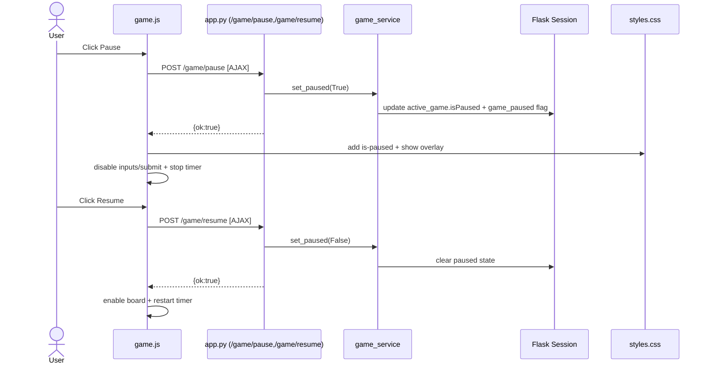

---

## Flow 4F - saveGame

### Step Mapping

- `saveGame()` UI trigger -> pause overlay form `#saveGameForm` in `kakuro/templates/game.html`.
- JS updates hidden `elapsed_time` value before submit (`renderTimer()` in `game.js`).
- Form posts `POST /game/save` to `kakuro/app.py`.
- Route checks active game and registered user (`session["user_id"]` required).
- Route parses `elapsed_time` (fallback to `game_session.elapsedTime`).
- Route calls `save_current_game(db_path, user_id, elapsed_time)`.
- Service updates in-memory `GameSession` fields and calls:
- `save_game(...)` for server session,
- `upsert_saved_game(...)` for SQLite persistence.
- `upsert_saved_game(...)` inserts/updates row in `saved_games` by unique `session_id`.
- Success redirects to `/menu`; failure redirects back to `/game`.

### Preconditions and Postconditions from Code

- Preconditions checked:
- active game session must exist.
- user must be registered (guest blocked).
- finished games cannot be saved.
- Postconditions achieved:
- saved row contains `session_id`, `user_id`, `board_state` JSON, `difficulty`, `elapsed_time`, `status`, `saved_at`.
- existing save for same `session_id` is updated (upsert).
- flash message reports success/failure.

### Class Diagram Mapping

- `SavedGame` concept maps to:
- `saved_games` table row,
- `SavedGame` dataclass in `kakuro/models/domain.py`,
- persistence helpers in `kakuro/models/saved_game.py`.
- `RegisteredUser` save ability is enforced by session `user_id` check in route.

### Sequence System

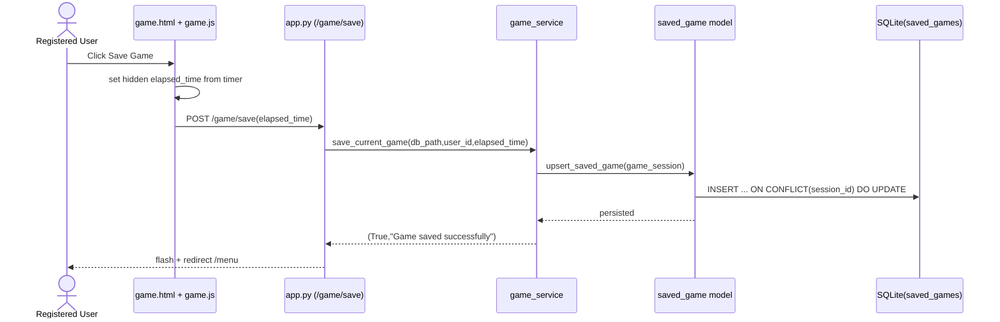

---

## Flow 4G - loadGame

### Step Mapping

- `loadGame()` trigger -> load links in `main_menu.html` and `base.html` (`GET /game/load`).
- Route in `kakuro/app.py` checks player context and registered user.
- Calls `load_latest_saved_game(db_path, user_id)` in `kakuro/services/game_service.py`.
- Service queries latest row with `get_latest_saved_game_for_user(...)` in `kakuro/models/saved_game.py`.
- Model reconstructs `SavedGame` dataclass and calls `.restore()` to `GameSession`.
- Service normalizes runtime state (`InProgress`, unpaused, no result), saves active game to session, and clears feedback.
- Route redirects to `/game`.
- `game.html` receives restored board and elapsed time; `game.js` starts timer from restored seconds.

### Preconditions and Postconditions from Code

- Preconditions checked:
- player context required.
- user must be registered.
- at least one saved game row must exist for user.
- Postconditions achieved:
- board state is restored from JSON into `Board`/`Cell` objects.
- elapsed time is restored to `game_session.elapsedTime`.
- active game session is replaced with loaded game state.
- pause flag and old feedback are reset.

### Class Diagram Mapping

- `SavedGame -> GameSession` reconstruction is explicit in `SavedGame.restore()`.
- `Board.from_dict(...)` + `Cell.from_dict(...)` rebuild object graph for gameplay continuation.

### Sequence System

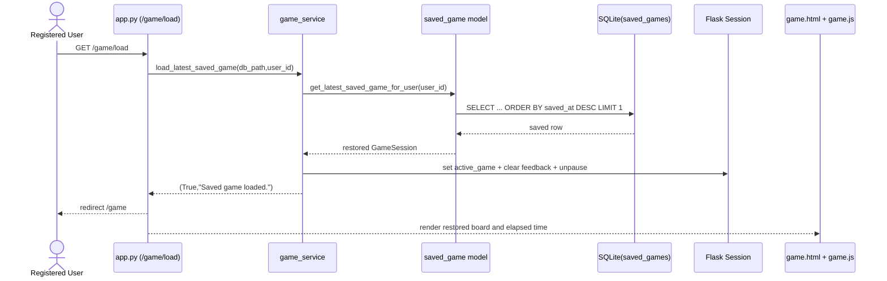

---

## Class Diagram to Code Mapping

### Text Mapping (Class Diagram -> Code)

- `User`:
- `kakuro/models/domain.py` dataclass with `userId`, `username`, `email`, `passwordHash`.
- Persisted through `kakuro/models/user.py` into `users` table (`kakuro/db/schema.sql`).

- `RegisteredUser`:
- Subclass exists in `kakuro/models/domain.py`.
- Session-level behavior for registered players is handled in `kakuro/app.py` and `kakuro/services/game_service.py`.

- `GuestUser`:
- Subclass exists in `kakuro/models/domain.py`.
- Guest mode is represented by session flags in `kakuro/app.py`.

- `GameSession`:
- Core gameplay aggregate in `kakuro/models/domain.py`.
- Stored/restored in Flask session via `kakuro/services/game_service.py` (`save_game`, `get_game`).
- Contains `Board`, gameplay state flags, elapsed time, and optional `Result`.

- `Board`:
- Implemented in `kakuro/models/domain.py` with `size`, `cells`, `getCell`, `validateEntry`, and matrix/run helpers.
- Instances are created by `kakuro/services/board_generator.py`.

- `Cell` / `PlayCell` / `ClueCell`:
- Implemented in `kakuro/models/domain.py`.
- `PlayCell` holds editable values and hint state.
- `ClueCell` carries clue sums via `clueDown`/`clueRight` (`verticalSum`/`horizontalSum` properties).

- `SavedGame`:
- Dataclass in `kakuro/models/domain.py`.
- Persistence functions in `kakuro/models/saved_game.py` (`upsert_saved_game`, `get_latest_saved_game_for_user`).
- Backed by SQLite table `saved_games`.

- `Result`:
- Dataclass in `kakuro/models/domain.py`.
- Created and attached on solved submit path in `kakuro/services/game_service.py`.

- `Leaderboard` concept:
- Implemented as service + model modules (not a single domain class).
- Service: `kakuro/services/leaderboard_service.py` (`calculate_score`, `record_completed_game`, `get_leaderboard`).
- Data access: `kakuro/models/leaderboard.py` (`add_leaderboard_entry`, `get_top_leaderboard_entries`).
- Backed by SQLite table `leaderboard_entries`.

- `DifficultyLevel`:
- Enum in `kakuro/models/domain.py`.
- Used by `GameSession` to normalize difficulty values.

---

## Scope Notes from Current Code

- Implemented in Iteration 2 scope:
- signup/login/logout, guest mode, new game, difficulty selection, board generation, move entry validation, submit + wrong-cell highlight, pause/resume, save/load for registered users, persistence in SQLite.

- Play Game subflow status:
- `enterNumber`, `submitBoard`, `pauseGame`, `saveGame`, `loadGame` are implemented end-to-end.
- `removeNumber` exists as behavior via `POST /game/enter` with empty value, but there is no dedicated `/game/remove` route.
- `checkHint` exists only as a domain method (`GameSession.checkHint`) and is not exposed through route/service/UI.

- Timer and pause details:
- timer is front-end JS (`setInterval`) and visual elapsed time.
- pause is both backend state (`isPaused` in session/GameSession) and frontend state (blur + overlay + disabled controls).
- elapsed time is synchronized to backend when saving (hidden input), not continuously every second.

- Exit protection / leaving active game confirmation:
- diagram concept exists, but no explicit confirmation handler (`beforeunload` or custom confirm flow) is implemented in current JS/routes.

- Route naming mismatches vs UML wording:
- difficulty selection uses `POST /new-game` (not a separate `/select-difficulty` endpoint).
- remove number uses `POST /game/enter` with empty value.
- load uses `GET /game/load`.

- Save/load behavior:
- save and load are restricted to registered users in route logic.
- load currently restores only the latest saved game (`ORDER BY saved_at DESC LIMIT 1`), not a selectable list.

- Improved generation/validation:
- board generator uses randomized layouts, run-length constraints, short-run removal, and backtracking assignment.
- submit validation includes duplicate detection, exact sum checks, and impossible-partial-run checks.

---

## Testing Summary (What We Test and How to Run)

### What is covered

- `tests/test_auth.py`
- Sign-up uniqueness checks for username and email.
- Login credential checks (valid and invalid password).
- Route behavior after sign-up (`POST /signup` redirects to `/login`).

- `tests/test_validation.py`
- Move-level duplicate rejection.
- Move-level behavior before full-submit validation.
- Submit-level wrong-cell detection and win case.
- Impossible partial-run detection.

- `tests/test_game_flow.py`
- `POST /game/submit` keeps game `InProgress` when incorrect.
- `POST /game/submit` marks game `Finished` with win result when correct.
- Registered user can save game to SQLite.
- Guest user cannot save game.
- `GET /game/load` restores saved board/session state.
- Paused game blocks `/game/enter`.

### Current gaps

- No automated tests for a hint route (feature not wired at route/UI level).
- No dedicated route tests for remove-number endpoint because removal is integrated into `/game/enter`.
- No frontend automation tests for blur visuals, timer display behavior, or exit confirmation flow.

### How to run

```bash
python -m pytest
```

Run single files if needed:

```bash
python -m pytest tests/test_auth.py
python -m pytest tests/test_validation.py
python -m pytest tests/test_game_flow.py
```

---

## Leaderboard Flow

### Score Calculation

The leaderboard score is computed in `kakuro/services/leaderboard_service.py::calculate_score(...)`.

- Base points by difficulty:
- `easy = 800`
- `medium = 1400`
- `hard = 2200`
- Speed bonus:
- `max(0, 1800 - elapsed_time_seconds)`
- Final score:
- `base_points + speed_bonus`

Examples:
- `easy`, `elapsed_time = 125` -> `800 + (1800 - 125) = 2475`
- `medium`, `elapsed_time = 210` -> `1400 + (1800 - 210) = 2990`

### Operation Contract - getLeaderboard()

- Operation: `getLeaderboard()`
- Use Case: View Leaderboard
- Preconditions:
- System is running.
- Postconditions:
- Leaderboard list is created.
- Each entry contains username and score.

### Sequence Diagram (Object Level)

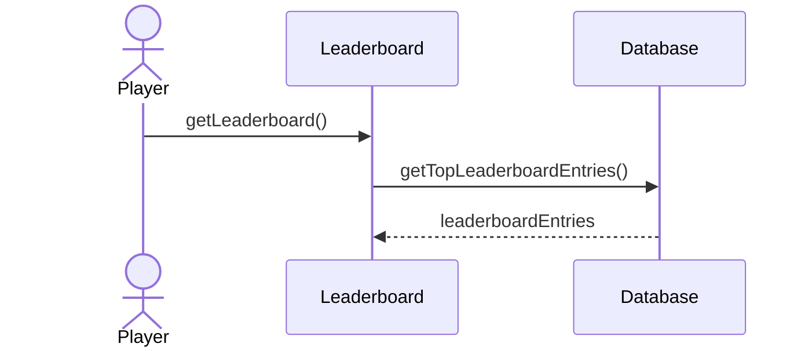

### System Operation

- `getLeaderboard()`

### System Sequence Diagram

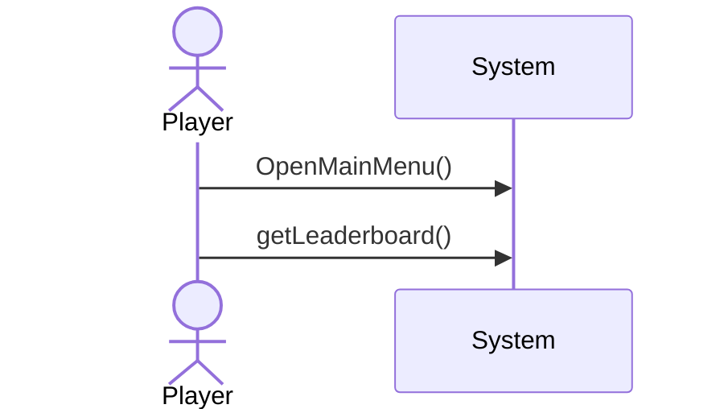

### Use Case - Leaderboard

- Actor: Player
- Main Use Case: View Leaderboard
- Includes:
- Display Rankings
- Show Username
- Show Score
